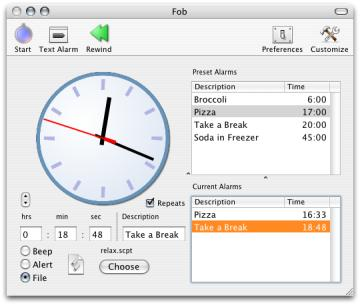
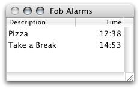
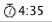
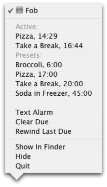

# Fob: Ancient History

This repository holds an ancient application "Fob" I wrote *many* years ago:
an alarm app I wrote because I wanted to be able to set an alarm without
typing anything, and with just two clicks. I have not updated it since 2004,
and have no plans to.

It is not a big deal, but was somewhat important to me in that it was the
first piece of software I wrote after graduation, and people [actually seemed
to like it a little][mw]. I do not have a Mac at this point so I have no idea
whether it builds using contemporaneous Xcode -- I have to imagine project
file formats and whatnot have changed a *lot* over fifteen years. (Indeed
until I looked it up just now, I had no idea whether Xcode was still a thing.)
If someone does find this repository useful, I wouldn't mind knowing that.

The commits to the repository mirror the versioned releases, except for
version 1.0.1 I evidently made a mistake and bundled the 1.0 source with the
1.0.1 release. I have the [Wayback machine archive of the old Fob page][wb] to
thank for its resurrection.

The remainder of the document from this point onwards is a reproduction of the
Fob description page, except instead of HTML it is in Markdown.

# Description

Fob is a free dock-based kitchen timer for Mac OS X by Leaky Puppy Software.
It allows a user to specify possibly multiple timers to count down for a
specified interval. When an alarm runs out of time, Fob will make itself
conspicuous.

(Fob is not an alarm clock or stopwatch, i.e., it will not count to a
particular time, nor count up.)

The presence of presets is Fob's main gimmick for decreasing the effort
required to start an alarm. To draw an analogy to web browsers, they are a
kind of time bookmark for commonly used alarms. For example, I may define a
six minute preset to let tea steep. Thence, I need only choose "Tea" from my
preset list, and I never need deal with a neglected lukewarm cup in my
microwave again. Starting a preset alarm requires only one mouse click rather
than many clicks and typing.

Fob thus appeals to the unspeakably lazy and undisciplined. Needless to say I
will make several million dollars.

I wrote Fob as an exercise in Cocoa and Objective-C programming. This was my
first serious attempt to create a Macintosh software product at least
ambiguously suitable for public consumption. As I wrote it largely as a
project to teach myself, I have released it as open source under the terms of
the GPL in the hope that others can learn from it.

Fob is free in both the code and monetary sense. As it is about the 100th
product to do the exact same thing, it had better be, I suppose.

# Feature Overview & Screenshots

To start alarms, drag around the clock's hands, or type in a time, or double
click a preset alarm you previously saved for a common task. Alarms can either
count down once, or repeat indefinitely. When an alarm is done it can play a
sound (system beeps or sound from a file), or launch a file, or perform an
AppleScript. Multiple alarms may count down concurrently.

Use the zoom button to collapse Fob's window to display only current alarms
for minimal use of space.

The functional dock icon displays the time till the alarm with the least time
remaining rings, and can flash and bounce whenever time on an alarm runs out
of time. If you don't like the dock, use the menu status item instead.

The dock menu allows you to pause active alarms and start preset alarms, as
well as perform other common actions without having to break your workflow.

[mw]: http://www.macworld.com/article/1040779/Updates1.html "Old Macworld review"
[wb]: http://web.archive.org/web/20100310150556/http://homepage.mac.com:80/tfinley/LeakyPuppy/fob.html "Wayback link to the page"